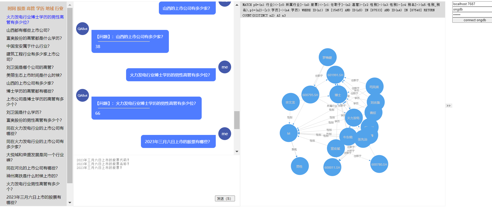

# Graph QABot Demo

## 一、软件安装
### 1.1 安装ONgDB
- 下载ONgDB，下载社区版和企业版都可以
```url
https://github.com/graphfoundation/ongdb/releases/tag/1.0.4
```

### 1.2 安装APOC和OLAB组件
>将组件下载后放置在<ONGDB_HOME>/plugins文件夹下面。

- 下载APOC
```url
# 下载all版本
https://github.com/graphfoundation/ongdb-apoc/releases/tag/3.4.0.10
```

- 下载OLAB
```url
https://github.com/ongdb-contrib/ongdb-lab-apoc/releases/tag/1.0.0
```

### 1.3 修改配置并启动ONgDB
- 修改配置文件
```shell
# conf/ongdb.conf
dbms.security.procedures.unrestricted=apoc.*,olab.*,custom.*
apoc.import.file.enabled=true
```

- 启动图数据库节点
```shell
# Windows启动ONgDB
bin\ongdb.bat console
```

## 二、获取数据
### 2.1 沪深股票
```python
import tushare as ts
import system_constant as sys_cnt
import os

# 初始化pro接口
pro = ts.pro_api(sys_cnt.tushare_token())


# 获取股票相关信息
def run():
    # 查询当前所有正常上市交易的股票列表
    data = pro.stock_basic(exchange='', list_status='L', fields='ts_code,symbol,name,area,industry,list_date')
    data.to_csv(path_or_buf=os.getcwd().replace('python', 'csv') + '\\stocks.csv',
              encoding='GBK',
              columns=['ts_code', 'symbol', 'name', 'area', 'industry', 'list_date'],
              index=False)


if __name__ == '__main__':
    run()
```

### 2.2 上市公司管理层
```python
import tushare as ts
import pandas as pd
import system_constant as sys_cnt
import os
import time

# 初始化pro接口
pro = ts.pro_api(sys_cnt.tushare_token())


# 获取股票相关信息
def run():
    # 查询当前所有正常上市交易的股票列表
    data = pro.stock_basic(exchange='', list_status='L', fields='ts_code,symbol,name,area,industry,list_date')
    tss = data['ts_code']
    result = []
    ct = 0
    bk_ct = 100000
    for code in tss:
        time.sleep(0.5)
        # 获取单个公司高管全部数据
        df = pro.stk_managers(ts_code=code)
        result.append(df)
        ct += 1
        if ct > bk_ct:
            break
    df_merge = pd.concat(result)
    print(df_merge)
    df_merge.to_csv(path_or_buf=os.getcwd().replace('python', 'csv') + '\\managers.csv',
                    encoding='GBK',
                    columns=['ts_code', 'ann_date', 'name', 'gender', 'lev', 'title', 'edu', 'national', 'birthday',
                             'begin_date', 'end_date'],
                    index=False)


if __name__ == '__main__':
    run()
```

## 三、设计图数据模型
>将下面的JSON格式数据导入，[Graphene图数据建模工具](https://ongdb-contrib.github.io/graphene/app/)。

```json
{"data":{"nodes":[{"x":613,"y":284,"color":"#E52B50","label":"股票代码","properties":[{"id":"a2aeffb2","key":"id","type":"ID","defaultValue":"","limitMin":"","limitMax":"","isRequired":true,"isAutoGenerated":true,"isSystem":true,"description":""},{"id":"afb48f90","key":"value","type":"","defaultValue":"","limitMin":"","limitMax":"","isRequired":false,"isAutoGenerated":false,"isSystem":false,"description":"值"}],"id":"a1b949a0","isSelected":false,"isNode":true},{"x":678,"y":444,"color":"#AB274F","label":"股票","properties":[{"id":"a4a8beb4","key":"id","type":"ID","defaultValue":"","limitMin":"","limitMax":"","isRequired":true,"isAutoGenerated":true,"isSystem":true,"description":""},{"id":"a9bf77ad","key":"value","type":"","defaultValue":"","limitMin":"","limitMax":"","isRequired":false,"isAutoGenerated":false,"isSystem":false,"description":"值"}],"id":"a5844bbd","isSelected":false,"isNode":true},{"x":413,"y":368,"color":"#3B7A57","label":"股票名称","properties":[{"id":"a08f768e","key":"id","type":"ID","defaultValue":"","limitMin":"","limitMax":"","isRequired":true,"isAutoGenerated":true,"isSystem":true,"description":""},{"id":"a09d0ab9","key":"value","type":"","defaultValue":"","limitMin":"","limitMax":"","isRequired":false,"isAutoGenerated":false,"isSystem":false,"description":"值"}],"id":"a78c159d","isSelected":false,"isNode":true},{"x":426,"y":475,"color":"#FF7E00","label":"地域","properties":[{"id":"a59d20a1","key":"id","type":"ID","defaultValue":"","limitMin":"","limitMax":"","isRequired":true,"isAutoGenerated":true,"isSystem":true,"description":""},{"id":"a28d19bb","key":"value","type":"","defaultValue":"","limitMin":"","limitMax":"","isRequired":false,"isAutoGenerated":false,"isSystem":false,"description":"值"}],"id":"a49f8ebc","isSelected":false,"isNode":true},{"x":481,"y":557,"color":"#FF033E","label":"行业","properties":[{"id":"aea1c5b2","key":"id","type":"ID","defaultValue":"","limitMin":"","limitMax":"","isRequired":true,"isAutoGenerated":true,"isSystem":true,"description":""},{"id":"aaa4b082","key":"value","type":"","defaultValue":"","limitMin":"","limitMax":"","isRequired":false,"isAutoGenerated":false,"isSystem":false,"description":"值"}],"id":"a381f688","isSelected":false,"isNode":true},{"x":714,"y":569,"color":"#AF002A","label":"上市日期","properties":[{"id":"a284f1aa","key":"id","type":"ID","defaultValue":"","limitMin":"","limitMax":"","isRequired":true,"isAutoGenerated":true,"isSystem":true,"description":""},{"id":"a0b444a4","key":"value","type":"","defaultValue":"","limitMin":"","limitMax":"","isRequired":false,"isAutoGenerated":false,"isSystem":false,"description":"值"}],"id":"ac81ffb4","isSelected":false,"isNode":true},{"x":834,"y":380,"color":"#E32636","label":"高管","properties":[{"id":"a4b02384","key":"id","type":"ID","defaultValue":"","limitMin":"","limitMax":"","isRequired":true,"isAutoGenerated":true,"isSystem":true,"description":""}],"id":"a2ade2ad","isSelected":false,"isNode":true},{"x":890,"y":266,"color":"#C46210","label":"性别","properties":[{"id":"ad9cab82","key":"id","type":"ID","defaultValue":"","limitMin":"","limitMax":"","isRequired":true,"isAutoGenerated":true,"isSystem":true,"description":""},{"id":"a2aa0f86","key":"value","type":"","defaultValue":"","limitMin":"","limitMax":"","isRequired":false,"isAutoGenerated":false,"isSystem":false,"description":"值"}],"id":"af9a0f97","isSelected":false,"isNode":true},{"x":977,"y":447,"color":"#E52B50","label":"学历","properties":[{"id":"a090f498","key":"id","type":"ID","defaultValue":"","limitMin":"","limitMax":"","isRequired":true,"isAutoGenerated":true,"isSystem":true,"description":""},{"id":"a8a0e1b4","key":"value","type":"","defaultValue":"","limitMin":"","limitMax":"","isRequired":false,"isAutoGenerated":false,"isSystem":false,"description":"值"}],"id":"ad931890","isSelected":false,"isNode":true},{"x":1001,"y":180,"color":"#AB274F","label":"性别_别名","properties":[{"id":"a3980888","key":"id","type":"ID","defaultValue":"","limitMin":"","limitMax":"","isRequired":true,"isAutoGenerated":true,"isSystem":true,"description":""}],"id":"aa8b5199","isSelected":false,"isNode":true}],"edges":[{"startNodeId":"a5844bbd","endNodeId":"a1b949a0","middlePointOffset":[0,0],"properties":[{"id":"a29766a0","key":"id","type":"ID","defaultValue":"","limitMin":"","limitMax":"","isRequired":true,"isAutoGenerated":true,"isSystem":true,"description":""}],"label":"股票代码","id":"a5934a81","isSelected":false,"isEdge":true},{"startNodeId":"a5844bbd","endNodeId":"a78c159d","middlePointOffset":[0,0],"properties":[{"id":"a196c08e","key":"id","type":"ID","defaultValue":"","limitMin":"","limitMax":"","isRequired":true,"isAutoGenerated":true,"isSystem":true,"description":""}],"label":"股票名称","id":"acaecfb9","isSelected":false,"isEdge":true},{"startNodeId":"a5844bbd","endNodeId":"a49f8ebc","middlePointOffset":[0,0],"properties":[{"id":"a88ae1a4","key":"id","type":"ID","defaultValue":"","limitMin":"","limitMax":"","isRequired":true,"isAutoGenerated":true,"isSystem":true,"description":""}],"label":"地域","id":"aa94de98","isSelected":false,"isEdge":true},{"startNodeId":"a5844bbd","endNodeId":"a381f688","middlePointOffset":[0,0],"properties":[{"id":"a493c4a1","key":"id","type":"ID","defaultValue":"","limitMin":"","limitMax":"","isRequired":true,"isAutoGenerated":true,"isSystem":true,"description":""}],"label":"所属行业","id":"aead0aa2","isSelected":false,"isEdge":true},{"startNodeId":"a5844bbd","endNodeId":"ac81ffb4","middlePointOffset":[0,0],"properties":[{"id":"aebda5bd","key":"id","type":"ID","defaultValue":"","limitMin":"","limitMax":"","isRequired":true,"isAutoGenerated":true,"isSystem":true,"description":""}],"label":"上市日期","id":"a19f3281","isSelected":false,"isEdge":true},{"startNodeId":"a2ade2ad","endNodeId":"a5844bbd","middlePointOffset":[0,0],"properties":[{"id":"adaf73aa","key":"id","type":"ID","defaultValue":"","limitMin":"","limitMax":"","isRequired":true,"isAutoGenerated":true,"isSystem":true,"description":""}],"label":"任职于","id":"a3bcec8c","isSelected":false,"isEdge":true},{"startNodeId":"a2ade2ad","endNodeId":"af9a0f97","middlePointOffset":[0,0],"properties":[{"id":"aca28680","key":"id","type":"ID","defaultValue":"","limitMin":"","limitMax":"","isRequired":true,"isAutoGenerated":true,"isSystem":true,"description":""}],"label":"性别","id":"ae973eb2","isSelected":false,"isEdge":true},{"startNodeId":"a2ade2ad","endNodeId":"ad931890","middlePointOffset":[0,0],"properties":[{"id":"a7af3fb0","key":"id","type":"ID","defaultValue":"","limitMin":"","limitMax":"","isRequired":true,"isAutoGenerated":true,"isSystem":true,"description":""}],"label":"学历","id":"aca71396","isSelected":false,"isEdge":true},{"startNodeId":"af9a0f97","endNodeId":"aa8b5199","middlePointOffset":[5.5,-6],"properties":[{"id":"a692c7a2","key":"id","type":"ID","defaultValue":"","limitMin":"","limitMax":"","isRequired":true,"isAutoGenerated":true,"isSystem":true,"description":""}],"label":"别名","id":"a9a6bb89","isSelected":false,"isEdge":true}]}}
```

## 四、构建图数据
### 4.1 设计索引和约束
```cypher
CREATE CONSTRAINT ON (n:股票代码) ASSERT (n.value) IS NODE KEY;
CREATE CONSTRAINT ON (n:股票) ASSERT (n.value) IS NODE KEY;
CREATE CONSTRAINT ON (n:股票名称) ASSERT (n.value) IS NODE KEY;
CREATE CONSTRAINT ON (n:地域) ASSERT (n.value) IS NODE KEY;
CREATE CONSTRAINT ON (n:行业) ASSERT (n.value) IS NODE KEY;
CREATE CONSTRAINT ON (n:上市日期) ASSERT (n.value) IS NODE KEY;
CREATE CONSTRAINT ON (n:高管) ASSERT (n.md5) IS NODE KEY;
CREATE INDEX ON :高管(value);
CREATE CONSTRAINT ON (n:性别) ASSERT (n.value) IS NODE KEY;
CREATE CONSTRAINT ON (n:学历) ASSERT (n.value) IS NODE KEY;
CREATE CONSTRAINT ON (n:性别_别名) ASSERT (n.value) IS NODE KEY;
```

### 4.2 构建数据
>将生成的CSV数据，放置在<ONGDB_HOME>/import目录下，CSV转为UTF-8-BOM格式（可以使用Notepad++转格式）。

```cypher
LOAD CSV WITH HEADERS FROM 'file:/stocks.csv' AS row
WITH row.ts_code AS fval,row.symbol AS tval
WHERE tval IS NOT NULL AND tval<>''
MERGE (f:股票 {value:fval})
MERGE (t:股票代码 {value:tval})
MERGE (f)-[:股票代码]->(t);

LOAD CSV WITH HEADERS FROM 'file:/stocks.csv' AS row
WITH row.ts_code AS fval,row.name AS tval
WHERE tval IS NOT NULL AND tval<>''
MERGE (f:股票 {value:fval})
MERGE (t:股票名称 {value:tval})
MERGE (f)-[:股票名称]->(t);

LOAD CSV WITH HEADERS FROM 'file:/stocks.csv' AS row
WITH row.ts_code AS fval,row.area AS tval
WHERE tval IS NOT NULL AND tval<>''
MERGE (f:股票 {value:fval})
MERGE (t:地域 {value:tval})
MERGE (f)-[:地域]->(t);

LOAD CSV WITH HEADERS FROM 'file:/stocks.csv' AS row
WITH row.ts_code AS fval,row.industry AS tval
WHERE tval IS NOT NULL AND tval<>''
MERGE (f:股票 {value:fval})
MERGE (t:行业 {value:tval})
MERGE (f)-[:所属行业]->(t);

LOAD CSV WITH HEADERS FROM 'file:/stocks.csv' AS row
WITH row.ts_code AS fval,row.list_date AS tval
WHERE tval IS NOT NULL AND tval<>''
MERGE (f:股票 {value:fval})
MERGE (t:上市日期 {value:TOINTEGER(tval)})
MERGE (f)-[:上市日期]->(t);

LOAD CSV WITH HEADERS FROM 'file:/managers.csv' AS row
WITH row,apoc.util.md5([row.name,row.gender,row.birthday]) AS fval,row.ts_code AS tval
WHERE tval IS NOT NULL AND tval<>'' AND fval IS NOT NULL AND fval<>'' AND (row.end_date IS NULL OR row.end_date='')
MERGE (f:高管 {md5:fval}) SET f+={value:row.name}
MERGE (t:股票 {value:tval})
MERGE (f)-[:任职于]->(t);

LOAD CSV WITH HEADERS FROM 'file:/managers.csv' AS row
WITH row,apoc.util.md5([row.name,row.gender,row.birthday]) AS fval,row.gender AS tval
WHERE tval IS NOT NULL AND tval<>'' AND fval IS NOT NULL AND fval<>'' AND (row.end_date IS NULL OR row.end_date='')
MERGE (f:高管 {md5:fval}) SET f+={value:row.name}
MERGE (t:性别 {value:tval})
MERGE (f)-[:性别]->(t);

LOAD CSV WITH HEADERS FROM 'file:/managers.csv' AS row
WITH row,apoc.util.md5([row.name,row.gender,row.birthday]) AS fval,row.edu AS tval
WHERE tval IS NOT NULL AND tval<>'' AND fval IS NOT NULL AND fval<>'' AND (row.end_date IS NULL OR row.end_date='')
MERGE (f:高管 {md5:fval}) SET f+={value:row.name}
MERGE (t:学历 {value:tval})
MERGE (f)-[:学历]->(t);

WITH ['女性','女'] AS list
UNWIND list AS wd
WITH wd
MATCH (n:性别) WHERE n.value='F' WITH n,wd
MERGE (t:性别_别名 {value:wd})
MERGE (n)-[:别名]->(t);

WITH ['男性','男'] AS list
UNWIND list AS wd
WITH wd
MATCH (n:性别) WHERE n.value='M' WITH n,wd
MERGE (t:性别_别名 {value:wd})
MERGE (n)-[:别名]->(t);
```

## 五、问答组件配置
### 5.1 配置图数据模型
```sql
CALL apoc.custom.asFunction(
'inference.search.qabot',
'RETURN \'{"graph":{"nodes":[{"properties_filter":[],"id":"1","labels":["股票代码"]},{"properties_filter":[],"id":"2","labels":["股票"]},{"properties_filter":[],"id":"3","labels":["股票名称"]},{"properties_filter":[],"id":"4","labels":["地域"]},{"properties_filter":[],"id":"5","labels":["行业"]},{"properties_filter":[],"id":"6","labels":["上市日期"]},{"properties_filter":[],"id":"7","labels":["高管"]},{"properties_filter":[],"id":"8","labels":["性别"]},{"properties_filter":[],"id":"9","labels":["学历"]},{"properties_filter":[],"id":"10","labels":["性别_别名"]}],"relationships":[{"startNode":"2","properties_filter":[],"id":"1","type":"股票代码","endNode":"1"},{"startNode":"2","properties_filter":[],"id":"2","type":"股票名称","endNode":"3"},{"startNode":"2","properties_filter":[],"id":"3","type":"地域","endNode":"4"},{"startNode":"2","properties_filter":[],"id":"4","type":"所属行业","endNode":"5"},{"startNode":"2","properties_filter":[],"id":"5","type":"上市日期","endNode":"6"},{"startNode":"7","properties_filter":[],"id":"6","type":"任职于","endNode":"2"},{"startNode":"7","properties_filter":[],"id":"7","type":"性别","endNode":"8"},{"startNode":"7","properties_filter":[],"id":"8","type":"学历","endNode":"9"},{"startNode":"8","properties_filter":[],"id":"9","type":"别名","endNode":"10"}]}}\' AS graphDataSchema',
'STRING',
NULL,
false,
'搜索时图数据扩展模式(schema)的动态获取'
);
```

### 5.2 配置实体权重规则
```sql
CALL apoc.custom.asFunction(
'inference.weight.qabot',
'RETURN \'{"LABEL":{"股票":12,"高管":11}}\' AS weight',
'STRING',
NULL,
false,
'本体权重'
);
```

### 5.3 配置实体搜索规则
```sql
CALL apoc.custom.asFunction(
'inference.match.qabot',
'RETURN \'{"股票名称":"value","地域":"value","上市日期":"value","性别_别名":"value","高管":"value","学历":"value","行业":"value","股票代码":"value"}\' AS nodeHitsRules',
'STRING',
NULL,
false,
'实体匹配规则'
);
```

### 5.4 配置意图匹配规则
>`CONTAINS`模式、`EQUALS`模式、`OTHER`词列表求交集模式
```sql
CALL apoc.custom.asFunction(
'inference.intended.qabot',
'RETURN \'[{"label":"上市日期","return_var_alias":"n1","sort":1,"list":["是什么时候","什么时候"],"parse_mode":"CONTAINS","order_by_field":null,"order_by_type":null},{"label":"学历","return_var_alias":"n2","sort":2,"list":["什么学历"],"parse_mode":"CONTAINS","order_by_field":null,"order_by_type":null},{"label":"高管","return_var_alias":"n3","sort":3,"list":["高管有多少位","高管都有哪些","高管有多少个"],"parse_mode":"CONTAINS","order_by_field":null,"order_by_type":null},{"label":"股票","return_var_alias":"n4","sort":4,"list":["哪些上市公司","有多少家上市公司","哪个公司","有多少家","公司有哪些","公司有多少家","股票有哪些","股票有多少支","股票有多少个","股票代码？","股票？"],"parse_mode":"CONTAINS","order_by_field":null,"order_by_type":null},{"label":"行业","return_var_alias":"n5","sort":5,"list":["什么行业","同一个行业嘛"],"parse_mode":"CONTAINS","order_by_field":null,"order_by_type":null},{"label":"股票名称","return_var_alias":"n6","sort":6,"list":["股票名称？"],"parse_mode":"CONTAINS","order_by_field":null,"order_by_type":null},{"label":"性别","return_var_alias":"n7","sort":7,"list":["性别"],"parse_mode":"OTHER","order_by_field":null,"order_by_type":null},{"label":"性别","return_var_alias":"n8","sort":8,"list":["查询性别"],"parse_mode":"EQUALS","order_by_field":null,"order_by_type":null}]\' AS intendedIntent',
'STRING',
NULL,
false,
'预期意图'
);
```

### 5.5 配置时间页码处理等规则
```sql
CALL apoc.custom.asFunction(
'inference.parseadd.qabot',
'WITH $time AS time,$page AS page,$entityRecognitionHit AS entityRecognitionHit WITH entityRecognitionHit,REDUCE(l=\'\',e IN time.list | l+\'({var}.value>=\'+TOINTEGER(apoc.date.convertFormat(e.detail.time[0],\'yyyy-MM-dd HH:mm:ss\',\'yyyyMMdd\'))+\' AND {var}.value<=\'+TOINTEGER(apoc.date.convertFormat(e.detail.time[1],\'yyyy-MM-dd HH:mm:ss\',\'yyyyMMdd\'))+\') OR \') AS timeFilter, REDUCE(l=\'\',e IN page.list | l+\'{var}.value\'+e[0]+e[1]+\' AND \') AS pageFilter CALL apoc.case([size(timeFilter)>4,\'RETURN SUBSTRING($timeFilter,0,size($timeFilter)-4) AS timeFilter\'],\'RETURN "" AS timeFilter\',{timeFilter:timeFilter}) YIELD value WITH entityRecognitionHit,value.timeFilter AS timeFilter,pageFilter CALL apoc.case([size(pageFilter)>5,\'RETURN SUBSTRING($pageFilter,0,size($pageFilter)-5) AS pageFilter\'],\'RETURN "" AS pageFilter\',{pageFilter:pageFilter}) YIELD value WITH entityRecognitionHit,timeFilter,value.pageFilter AS pageFilter WITH entityRecognitionHit,timeFilter,pageFilter CALL apoc.case([timeFilter<>"",\'RETURN apoc.map.setPairs({},[[\\\'上市日期\\\',[{category:\\\'node\\\',labels:[\\\'上市日期\\\'],properties_filter:[{value:$timeFilter}]}]]]) AS time\'],\'RETURN {} AS time\',{timeFilter:timeFilter}) YIELD value WITH value.time AS time,pageFilter,entityRecognitionHit CALL apoc.case([pageFilter<>"",\'RETURN apoc.map.setPairs({},[[\\\'文章页数\\\',[{category:\\\'node\\\',labels:[\\\'文章页数\\\'],properties_filter:[{value:$pageFilter}]}]]]) AS page\'],\'RETURN {} AS page\',{pageFilter:pageFilter}) YIELD value WITH value.page AS page,time,entityRecognitionHit RETURN apoc.map.setKey({},\'entities\',apoc.map.merge(apoc.map.merge(entityRecognitionHit.entities,time),page)) AS entityRecognitionHit',
'MAP',
[['entityRecognitionHit','MAP'],['time','MAP'],['page','MAP']],
false,
'问答解析的内容增加到entityRecognitionHit'
);
```

### 5.6 配置算子规则
```sql
CALL apoc.custom.asFunction(
'inference.operators.qabot',
'RETURN \'[{"keywords":["最多","最大"],"operator":{"sort": 1,"agg_operator_field": "value","agg_operator": "MAX","agg_operator_type": "NODE"}},{"keywords":["最小","最少"],"operator":{"sort": 2,"agg_operator_field": "value","agg_operator": "MIN","agg_operator_type": "NODE"}},{"keywords":["平均"],"operator":{"sort": 3,"agg_operator_field": "value","agg_operator": "AVG","agg_operator_type": "NODE"}},{"keywords":["有多少","有多少只","有多少支","多少只","多少支","多少","一共"],"operator":{"sort": 5,"agg_operator_field": "value","agg_operator": "COUNT","agg_operator_type": "NODE"}}]\' AS weight',
'STRING',
NULL,
false,
'配置算子规则'
);
```

### 5.7 算子解析模块配置
```sql
CALL apoc.custom.asFunction(
'inference.operators.parse',
'WITH $query AS query,custom.inference.operators.qabot() AS list WITH query,apoc.convert.fromJsonList(list) AS list UNWIND list AS map WITH map,REDUCE(l=[],em IN apoc.coll.sortMaps(REDUCE(l=[],e IN map.keywords | l+{wd:e,len:LENGTH(e)}),\'len\')| l+em.wd) AS keywords,query UNWIND keywords AS keyword WITH map,keyword,query CALL apoc.case([query CONTAINS keyword,\'RETURN $keyword AS hit\'],\'RETURN \\\' \\\' AS hit\',{keyword:keyword}) YIELD value WITH map,keyword,query,REPLACE(query,value.hit,\' \') AS trim_query,value.hit AS hit WITH query,trim_query,map.operator AS operator ORDER BY map.operator.sort ASC WITH COLLECT({query:query,trim_query:trim_query,operator:operator}) AS list WITH FILTER(e IN list WHERE e.query<>e.trim_query)[0] AS map,list WITH map,list[0] AS smap CALL apoc.case([map IS NOT NULL,\'RETURN $map AS map\'],\'RETURN $smap AS map\',{map:map,smap:smap}) YIELD value WITH value.map AS map CALL apoc.case([map.trim_query=map.query,\'RETURN {} AS operator\'],\'RETURN $operator AS operator\',{trim_query:map.trim_query,operator:map.operator}) YIELD value RETURN map.query AS query,map.trim_query AS trim_query,value.operator AS operator',
'MAP',
[['query','STRING']],
false,
'算子解析'
);
```

## 六、配置词库
### 6.1 安装词库依赖
>下载下面的文件夹，放置在<ONGDB_HOME>根目录下，并设置Python的执行路径和词典位置。
```url
https://github.com/ongdb-contrib/ongdb-lab-apoc/tree/1.0/nlp
```

```shell
# nlp/nlp.properties
defined.dic.path=nlp/dic/dynamic/dynamic.dic
python.commands.path=E:\\software\\anaconda3\\python.exe
```

### 6.2 配置词
```cypher
//dic,dynamic,dynamic.dic
//意图配置相关词
WITH custom.inference.intended.qabot() AS str
WITH apoc.convert.fromJsonList(str) as list
UNWIND list AS map
WITH map.label AS label,map.list as list,map
WHERE UPPER(map.parse_mode)<>'CONTAINS' AND UPPER(map.parse_mode)<>'EQUALS'
WITH apoc.coll.union([label],list) as list
UNWIND list AS wd
WITH collect(DISTINCT wd) AS list
RETURN olab.nlp.userdic.add('dynamic.dic',list,true,'UTF-8') AS words;

//图数据模型相关词
WITH custom.inference.search.qabot() AS str
WITH apoc.convert.fromJsonMap(str).graph AS graph
WITH graph.relationships AS relationships,graph.nodes AS nodes
WITH REDUCE(l=[],e IN relationships | l+e.type) AS relationships,REDUCE(l=[],e IN nodes | l+e.labels[0]) AS nodes
WITH apoc.coll.union(relationships,nodes) AS list
RETURN olab.nlp.userdic.add('dynamic.dic',list,true,'UTF-8') AS words;

//实体匹配规则相关词
WITH custom.inference.match.qabot() AS str
WITH olab.map.keys(apoc.convert.fromJsonMap(str)) AS list
UNWIND list AS lb
WITH lb
WHERE lb<>'性别' AND lb<>'上市日期'
CALL apoc.cypher.run('MATCH (n:'+lb+') WHERE NOT n.value CONTAINS \' \' RETURN COLLECT(DISTINCT n.value) AS list',{}) YIELD value
WITH value.list AS list
RETURN olab.nlp.userdic.add('dynamic.dic',list,true,'UTF-8') AS words;

RETURN olab.nlp.userdic.add('dynamic.dic',['测试','胡永乐','性别'],true,'UTF-8') AS words;
```

### 6.3 词库热更新
```cypher
RETURN olab.nlp.userdic.refresh();
```

## 七、安装问答模块存储过程
### 7.1 问答结果
#### 7.1.1 意图字符匹配和列表求交集【非分类模型解意图】
```sql
// 1.搜索语句
WITH LOWER('火力发电行业博士学历的男性高管有多少位？') AS query
// 2.个性化配置：图数据模型/本体权重/实体匹配规则/预期意图
WITH query,
     custom.inference.search.qabot() AS graphDataSchema,
     custom.inference.weight.qabot() AS weight,
     custom.inference.match.qabot() AS nodeHitsRules,
     //预期意图定义中支持设置一个排序参数
     custom.inference.intended.qabot() AS intendedIntent,
     custom.inference.operators.parse(query) AS oper
// 3.个性化语句解析：解析时间/解析页面
WITH oper,oper.query AS query,oper.operator AS operator,graphDataSchema,weight,nodeHitsRules,intendedIntent,
     olab.nlp.timeparser(oper.query) AS time,olab.nlp.pagenum.parse(oper.query) AS page
// 4.从查询语句中过滤时间词
WITH oper,operator,graphDataSchema,weight,nodeHitsRules,intendedIntent,time,page,
     olab.replace(query,REDUCE(l=[],mp IN time.list | l+{raw:mp.text,rep:' '})) AS query
// 5.过滤时间词后进行分词
WITH oper,operator,graphDataSchema,weight,nodeHitsRules,intendedIntent,time,page,
     olab.hanlp.standard.segment(query) AS words
// 6.分词后结果只保留名词且不能是纯数字
WITH oper,operator,graphDataSchema,weight,nodeHitsRules,intendedIntent,time,page,
     EXTRACT(m IN FILTER(mp IN words WHERE (mp.nature STARTS WITH 'n' AND olab.string.matchCnEn(mp.word)<>'') OR mp.nature='uw')| m.word) AS words
// 7.实体识别
WITH oper,operator,graphDataSchema,weight,nodeHitsRules,intendedIntent,time,page,words,
     olab.entity.recognition(graphDataSchema,nodeHitsRules,NULL,'EXACT',words,{isMergeLabelHit:true,labelMergeDis:0.5}) AS entityRecognitionHits
// 8.生成权重搜索队列
WITH oper,operator,graphDataSchema,weight,intendedIntent,time,page,words,entityRecognitionHits
CALL olab.entity.ptmd.queue(graphDataSchema,entityRecognitionHits,weight) YIELD value
WITH oper,operator,graphDataSchema,intendedIntent,time,page,words,value AS entityRecognitionHit LIMIT 1
// 9.将个性化语句解析结果增加到entityRecognitionHit
WITH oper,operator,graphDataSchema,intendedIntent,words,custom.inference.parseadd.qabot(entityRecognitionHit,time,page).entityRecognitionHit AS entityRecognitionHit
// 10.意图识别
WITH oper,operator,graphDataSchema,intendedIntent,words,entityRecognitionHit,
     apoc.convert.toJson(olab.intent.schema.parse(graphDataSchema,oper.query,words,intendedIntent)) AS intentSchema
WHERE SIZE(apoc.convert.fromJsonList(intendedIntent))>SIZE(apoc.convert.fromJsonMap(intentSchema).graph.nodes)
// 11.图上下文语义解析
WITH operator,graphDataSchema,intentSchema,intendedIntent,
     olab.semantic.schema(graphDataSchema,intentSchema,apoc.convert.toJson(entityRecognitionHit)) AS semantic_schema
// 12.查询转换【不设置skip参数,每个查询抽取100条结果】
WITH olab.semantic.cypher(apoc.convert.toJson(semantic_schema),intentSchema,-1,10,{},operator) AS cypher
WITH REPLACE(cypher,'RETURN n','RETURN DISTINCT n') AS cypher
// 13.执行查询【value返回为一个MAP，MAP的KEY SIZE小于等于解析后返回意图类别个数】
CALL apoc.cypher.run(cypher,{}) YIELD value WITH value SKIP 0 LIMIT 10
WITH olab.map.keys(value) AS keys,value
UNWIND keys AS key
WITH apoc.map.get(value,key) AS n
CALL apoc.case([apoc.coll.contains(['NODE'],apoc.meta.cypher.type(n)),'WITH $n AS n,LABELS($n) AS lbs WITH lbs[0] AS label,n.value AS value RETURN label+$sml+UPPER(TOSTRING(value)) AS result'],'WITH $n AS n RETURN TOSTRING(n) AS result',{n:n,sml:'：'}) YIELD value
RETURN value.result AS result;
```

```sql
CALL apoc.custom.asProcedure(
'qabot',
'WITH LOWER($ask) AS query WITH query,  custom.inference.search.qabot() AS graphDataSchema,  custom.inference.weight.qabot() AS weight,  custom.inference.match.qabot() AS nodeHitsRules,  custom.inference.intended.qabot() AS intendedIntent,  custom.inference.operators.parse(query) AS oper WITH oper,oper.query AS query,oper.operator AS operator,graphDataSchema,weight,nodeHitsRules,intendedIntent,  olab.nlp.timeparser(oper.query) AS time,olab.nlp.pagenum.parse(oper.query) AS page WITH oper,operator,graphDataSchema,weight,nodeHitsRules,intendedIntent,time,page,  olab.replace(query,REDUCE(l=[],mp IN time.list | l+{raw:mp.text,rep:\' \'})) AS query WITH oper,operator,graphDataSchema,weight,nodeHitsRules,intendedIntent,time,page,  olab.hanlp.standard.segment(query) AS words WITH oper,operator,graphDataSchema,weight,nodeHitsRules,intendedIntent,time,page,  EXTRACT(m IN FILTER(mp IN words WHERE (mp.nature STARTS WITH \'n\' AND olab.string.matchCnEn(mp.word)<>\'\') OR mp.nature=\'uw\')| m.word) AS words WITH oper,operator,graphDataSchema,weight,nodeHitsRules,intendedIntent,time,page,words,  olab.entity.recognition(graphDataSchema,nodeHitsRules,NULL,\'EXACT\',words,{isMergeLabelHit:true,labelMergeDis:0.5}) AS entityRecognitionHits WITH oper,operator,graphDataSchema,weight,intendedIntent,time,page,words,entityRecognitionHits CALL olab.entity.ptmd.queue(graphDataSchema,entityRecognitionHits,weight) YIELD value WITH oper,operator,graphDataSchema,intendedIntent,time,page,words,value AS entityRecognitionHit LIMIT 1 WITH oper,operator,graphDataSchema,intendedIntent,words,custom.inference.parseadd.qabot(entityRecognitionHit,time,page).entityRecognitionHit AS entityRecognitionHit WITH oper,operator,graphDataSchema,intendedIntent,words,entityRecognitionHit,  apoc.convert.toJson(olab.intent.schema.parse(graphDataSchema,oper.query,words,intendedIntent)) AS intentSchema WHERE SIZE(apoc.convert.fromJsonList(intendedIntent))>SIZE(apoc.convert.fromJsonMap(intentSchema).graph.nodes) WITH operator,graphDataSchema,intentSchema,intendedIntent,  olab.semantic.schema(graphDataSchema,intentSchema,apoc.convert.toJson(entityRecognitionHit)) AS semantic_schema WITH olab.semantic.cypher(apoc.convert.toJson(semantic_schema),intentSchema,-1,10,{},operator) AS cypher WITH REPLACE(cypher,\'RETURN n\',\'RETURN DISTINCT n\') AS cypher CALL apoc.cypher.run(cypher,{}) YIELD value WITH value SKIP 0 LIMIT 10 WITH olab.map.keys(value) AS keys,value UNWIND keys AS key WITH apoc.map.get(value,key) AS n CALL apoc.case([apoc.coll.contains([\'NODE\'],apoc.meta.cypher.type(n)),\'WITH $n AS n,LABELS($n) AS lbs WITH lbs[0] AS label,n.value AS value RETURN label+$sml+UPPER(TOSTRING(value)) AS result\'],\'WITH $n AS n RETURN TOSTRING(n) AS result\',{n:n,sml:\'：\'}) YIELD value RETURN value.result AS result;',
'READ',
[['result','STRING']],
[['ask','STRING']],
'问答机器人'
);
```

```sql
CALL custom.qabot('火力发电行业博士学历的男性高管有多少位？') YIELD result RETURN result;
```

#### 7.1.2 带分类模型的查询方式【分类模型解意图】
```json
问题：胡永乐是男性还是女性？
问题类别：查询性别
```
```sql
// 1.搜索语句
WITH LOWER('胡永乐是男性还是女性？') AS query,'查询性别' AS classifier_type
// 2.个性化配置：图数据模型/本体权重/实体匹配规则/预期意图
WITH classifier_type,query,
     custom.inference.search.qabot() AS graphDataSchema,
     custom.inference.weight.qabot() AS weight,
     custom.inference.match.qabot() AS nodeHitsRules,
     //预期意图定义中支持设置一个排序参数
     custom.inference.intended.qabot() AS intendedIntent,
     custom.inference.operators.parse(query) AS oper
// 3.个性化语句解析：解析时间/解析页面
WITH classifier_type,oper,oper.query AS query,oper.operator AS operator,graphDataSchema,weight,nodeHitsRules,intendedIntent,
     olab.nlp.timeparser(oper.query) AS time,olab.nlp.pagenum.parse(oper.query) AS page
// 4.从查询语句中过滤时间词
WITH classifier_type,oper,operator,graphDataSchema,weight,nodeHitsRules,intendedIntent,time,page,
     olab.replace(query,REDUCE(l=[],mp IN time.list | l+{raw:mp.text,rep:' '})) AS query
// 5.过滤时间词后进行分词
WITH classifier_type,oper,operator,graphDataSchema,weight,nodeHitsRules,intendedIntent,time,page,
     olab.hanlp.standard.segment(query) AS words
// 6.分词后结果只保留名词且不能是纯数字
WITH classifier_type,oper,operator,graphDataSchema,weight,nodeHitsRules,intendedIntent,time,page,
     EXTRACT(m IN FILTER(mp IN words WHERE (mp.nature STARTS WITH 'n' AND olab.string.matchCnEn(mp.word)<>'') OR mp.nature='uw')| m.word) AS words
// 7.实体识别
WITH classifier_type,oper,operator,graphDataSchema,weight,nodeHitsRules,intendedIntent,time,page,words,
     olab.entity.recognition(graphDataSchema,nodeHitsRules,NULL,'EXACT',words,{isMergeLabelHit:true,labelMergeDis:0.5}) AS entityRecognitionHits
// 8.生成权重搜索队列
WITH classifier_type,oper,operator,graphDataSchema,weight,intendedIntent,time,page,words,entityRecognitionHits
CALL olab.entity.ptmd.queue(graphDataSchema,entityRecognitionHits,weight) YIELD value
WITH classifier_type,oper,operator,graphDataSchema,intendedIntent,time,page,words,value AS entityRecognitionHit LIMIT 1
// 9.将个性化语句解析结果增加到entityRecognitionHit
WITH classifier_type,oper,operator,graphDataSchema,intendedIntent,words,custom.inference.parseadd.qabot(entityRecognitionHit,time,page).entityRecognitionHit AS entityRecognitionHit
// 10.意图识别
WITH classifier_type,oper,operator,graphDataSchema,intendedIntent,words,entityRecognitionHit,
     apoc.convert.toJson(olab.intent.schema.parse(graphDataSchema,oper.query,words,intendedIntent,classifier_type)) AS intentSchema
WHERE SIZE(apoc.convert.fromJsonList(intendedIntent))>SIZE(apoc.convert.fromJsonMap(intentSchema).graph.nodes)
// 11.图上下文语义解析
WITH operator,graphDataSchema,intentSchema,intendedIntent,
     olab.semantic.schema(graphDataSchema,intentSchema,apoc.convert.toJson(entityRecognitionHit)) AS semantic_schema
// 12.查询转换【不设置skip参数,每个查询抽取100条结果】
WITH olab.semantic.cypher(apoc.convert.toJson(semantic_schema),intentSchema,-1,10,{},operator) AS cypher
WITH REPLACE(cypher,'RETURN n','RETURN DISTINCT n') AS cypher
// 13.执行查询【value返回为一个MAP，MAP的KEY SIZE小于等于解析后返回意图类别个数】
CALL apoc.cypher.run(cypher,{}) YIELD value WITH value SKIP 0 LIMIT 10
WITH olab.map.keys(value) AS keys,value
UNWIND keys AS key
WITH apoc.map.get(value,key) AS n
CALL apoc.case([apoc.coll.contains(['NODE'],apoc.meta.cypher.type(n)),'WITH $n AS n,LABELS($n) AS lbs WITH lbs[0] AS label,n.value AS value RETURN label+$sml+UPPER(TOSTRING(value)) AS result'],'WITH $n AS n RETURN TOSTRING(n) AS result',{n:n,sml:'：'}) YIELD value
RETURN value.result AS result;
```

### 7.2 问答结果Cypher
```sql
// 1.搜索语句
WITH LOWER('火力发电行业博士学历的男性高管有多少位？') AS query
// 2.个性化配置：图数据模型/本体权重/实体匹配规则/预期意图
WITH query,
     custom.inference.search.qabot() AS graphDataSchema,
     custom.inference.weight.qabot() AS weight,
     custom.inference.match.qabot() AS nodeHitsRules,
     //预期意图定义中支持设置一个排序参数
     custom.inference.intended.qabot() AS intendedIntent,
     custom.inference.operators.parse(query) AS oper
// 3.个性化语句解析：解析时间/解析页面
WITH oper,oper.query AS query,oper.operator AS operator,graphDataSchema,weight,nodeHitsRules,intendedIntent,
     olab.nlp.timeparser(oper.query) AS time,olab.nlp.pagenum.parse(oper.query) AS page
// 4.从查询语句中过滤时间词
WITH oper,operator,graphDataSchema,weight,nodeHitsRules,intendedIntent,time,page,
     olab.replace(query,REDUCE(l=[],mp IN time.list | l+{raw:mp.text,rep:' '})) AS query
// 5.过滤时间词后进行分词
WITH oper,operator,query,graphDataSchema,weight,nodeHitsRules,intendedIntent,time,page,
     olab.hanlp.standard.segment(query) AS words
// 6.分词后结果只保留名词且不能是纯数字
WITH oper,operator,query,graphDataSchema,weight,nodeHitsRules,intendedIntent,time,page,
     EXTRACT(m IN FILTER(mp IN words WHERE (mp.nature STARTS WITH 'n' AND olab.string.matchCnEn(mp.word)<>'') OR mp.nature='uw')| m.word) AS words
// 7.实体识别
WITH oper,operator,graphDataSchema,weight,nodeHitsRules,intendedIntent,time,page,words,
     olab.entity.recognition(graphDataSchema,nodeHitsRules,NULL,'EXACT',words,{isMergeLabelHit:true,labelMergeDis:0.5}) AS entityRecognitionHits
// 8.生成权重搜索队列
WITH oper,operator,graphDataSchema,weight,intendedIntent,time,page,words,entityRecognitionHits
CALL olab.entity.ptmd.queue(graphDataSchema,entityRecognitionHits,weight) YIELD value
WITH oper,operator,graphDataSchema,intendedIntent,time,page,words,value AS entityRecognitionHit LIMIT 1
// 9.将个性化语句解析结果增加到entityRecognitionHit
WITH oper,operator,graphDataSchema,intendedIntent,words,custom.inference.parseadd.qabot(entityRecognitionHit,time,page).entityRecognitionHit AS entityRecognitionHit
// 10.意图识别
WITH operator,graphDataSchema,intendedIntent,words,entityRecognitionHit,
     apoc.convert.toJson(olab.intent.schema.parse(graphDataSchema,oper.query,words,intendedIntent)) AS intentSchema
WHERE SIZE(apoc.convert.fromJsonList(intendedIntent))>SIZE(apoc.convert.fromJsonMap(intentSchema).graph.nodes)
// 11.图上下文语义解析
WITH operator,graphDataSchema,intentSchema,intendedIntent,
     olab.semantic.schema(graphDataSchema,intentSchema,apoc.convert.toJson(entityRecognitionHit)) AS semantic_schema
// 12.查询转换【不设置skip参数,每个查询抽取100条结果】
WITH olab.semantic.cypher(apoc.convert.toJson(semantic_schema),intentSchema,-1,10,{},operator) AS cypher
WITH REPLACE(cypher,'RETURN n','RETURN DISTINCT n') AS cypher
RETURN cypher;
```

```sql
CALL apoc.custom.asProcedure(
'qabot.cypher',
'WITH LOWER($ask) AS query WITH query,  custom.inference.search.qabot() AS graphDataSchema,  custom.inference.weight.qabot() AS weight,  custom.inference.match.qabot() AS nodeHitsRules,  custom.inference.intended.qabot() AS intendedIntent,  custom.inference.operators.parse(query) AS oper WITH oper,oper.query AS query,oper.operator AS operator,graphDataSchema,weight,nodeHitsRules,intendedIntent,  olab.nlp.timeparser(oper.query) AS time,olab.nlp.pagenum.parse(oper.query) AS page WITH oper,operator,graphDataSchema,weight,nodeHitsRules,intendedIntent,time,page,  olab.replace(query,REDUCE(l=[],mp IN time.list | l+{raw:mp.text,rep:\' \'})) AS query WITH oper,operator,query,graphDataSchema,weight,nodeHitsRules,intendedIntent,time,page,  olab.hanlp.standard.segment(query) AS words WITH oper,operator,query,graphDataSchema,weight,nodeHitsRules,intendedIntent,time,page,  EXTRACT(m IN FILTER(mp IN words WHERE (mp.nature STARTS WITH \'n\' AND olab.string.matchCnEn(mp.word)<>\'\') OR mp.nature=\'uw\')| m.word) AS words WITH oper,operator,graphDataSchema,weight,nodeHitsRules,intendedIntent,time,page,words,  olab.entity.recognition(graphDataSchema,nodeHitsRules,NULL,\'EXACT\',words,{isMergeLabelHit:true,labelMergeDis:0.5}) AS entityRecognitionHits WITH oper,operator,graphDataSchema,weight,intendedIntent,time,page,words,entityRecognitionHits CALL olab.entity.ptmd.queue(graphDataSchema,entityRecognitionHits,weight) YIELD value WITH oper,operator,graphDataSchema,intendedIntent,time,page,words,value AS entityRecognitionHit LIMIT 1 WITH oper,operator,graphDataSchema,intendedIntent,words,custom.inference.parseadd.qabot(entityRecognitionHit,time,page).entityRecognitionHit AS entityRecognitionHit WITH operator,graphDataSchema,intendedIntent,words,entityRecognitionHit,  apoc.convert.toJson(olab.intent.schema.parse(graphDataSchema,oper.query,words,intendedIntent)) AS intentSchema WHERE SIZE(apoc.convert.fromJsonList(intendedIntent))>SIZE(apoc.convert.fromJsonMap(intentSchema).graph.nodes) WITH operator,graphDataSchema,intentSchema,intendedIntent,  olab.semantic.schema(graphDataSchema,intentSchema,apoc.convert.toJson(entityRecognitionHit)) AS semantic_schema WITH olab.semantic.cypher(apoc.convert.toJson(semantic_schema),intentSchema,-1,10,{},operator) AS cypher WITH REPLACE(cypher,\'RETURN n\',\'RETURN DISTINCT n\') AS cypher RETURN cypher;',
'READ',
[['cypher','STRING']],
[['ask','STRING']],
'问答机器人：生成查询语句'
);
```

```sql
CALL custom.qabot.cypher('火力发电行业博士学历的男性高管有多少位？') YIELD cypher RETURN cypher;
```

### 7.3 问答推理图谱
```sql
// 1.搜索语句
WITH LOWER('火力发电行业博士学历的男性高管有多少位？') AS query
// 2.个性化配置：图数据模型/本体权重/实体匹配规则/预期意图
WITH query,
     custom.inference.search.qabot() AS graphDataSchema,
     custom.inference.weight.qabot() AS weight,
     custom.inference.match.qabot() AS nodeHitsRules,
     //预期意图定义中支持设置一个排序参数
     custom.inference.intended.qabot() AS intendedIntent
// 3.个性化语句解析：解析时间/解析页面
WITH query AS oper,query,graphDataSchema,weight,nodeHitsRules,intendedIntent,
     olab.nlp.timeparser(query) AS time,olab.nlp.pagenum.parse(query) AS page
// 4.从查询语句中过滤时间词
WITH oper,graphDataSchema,weight,nodeHitsRules,intendedIntent,time,page,
     olab.replace(query,REDUCE(l=[],mp IN time.list | l+{raw:mp.text,rep:' '})) AS query
// 5.过滤时间词后进行分词
WITH oper,query,graphDataSchema,weight,nodeHitsRules,intendedIntent,time,page,
     olab.hanlp.standard.segment(query) AS words
// 6.分词后结果只保留名词且不能是纯数字
WITH oper,query,graphDataSchema,weight,nodeHitsRules,intendedIntent,time,page,
     EXTRACT(m IN FILTER(mp IN words WHERE (mp.nature STARTS WITH 'n' AND olab.string.matchCnEn(mp.word)<>'') OR mp.nature='uw')| m.word) AS words
// 7.实体识别
WITH oper,graphDataSchema,weight,nodeHitsRules,intendedIntent,time,page,words,
     olab.entity.recognition(graphDataSchema,nodeHitsRules,NULL,'EXACT',words,{isMergeLabelHit:true,labelMergeDis:0.5}) AS entityRecognitionHits
// 8.生成权重搜索队列
WITH oper,graphDataSchema,weight,intendedIntent,time,page,words,entityRecognitionHits
CALL olab.entity.ptmd.queue(graphDataSchema,entityRecognitionHits,weight) YIELD value
WITH oper,graphDataSchema,intendedIntent,time,page,words,value AS entityRecognitionHit LIMIT 1
// 9.将个性化语句解析结果增加到entityRecognitionHit
WITH oper,graphDataSchema,intendedIntent,words,custom.inference.parseadd.qabot(entityRecognitionHit,time,page).entityRecognitionHit AS entityRecognitionHit
// 10.意图识别
WITH graphDataSchema,intendedIntent,words,entityRecognitionHit,
     apoc.convert.toJson(olab.intent.schema.parse(graphDataSchema,oper,words,intendedIntent)) AS intentSchema
WHERE SIZE(apoc.convert.fromJsonList(intendedIntent))>SIZE(apoc.convert.fromJsonMap(intentSchema).graph.nodes)
// 11.图上下文语义解析
WITH graphDataSchema,intentSchema,intendedIntent,
     olab.semantic.schema(graphDataSchema,intentSchema,apoc.convert.toJson(entityRecognitionHit)) AS semantic_schema
// 12.查询转换【不设置skip参数,每个查询抽取100条结果】
WITH olab.semantic.cypher(apoc.convert.toJson(semantic_schema),'',-1,10,{}) AS cypher
// 13.执行查询【value返回为一个MAP，MAP的KEY SIZE小于等于解析后返回意图类别个数】
CALL apoc.cypher.run(cypher,{}) YIELD value WITH value SKIP 0 LIMIT 10
WITH value.graph AS graph
UNWIND graph AS path
RETURN path;
```

```sql
CALL apoc.custom.asProcedure(
'qabot.graph',
'WITH LOWER($ask) AS query WITH query,  custom.inference.search.qabot() AS graphDataSchema,  custom.inference.weight.qabot() AS weight,  custom.inference.match.qabot() AS nodeHitsRules,  custom.inference.intended.qabot() AS intendedIntent WITH query AS oper,query,graphDataSchema,weight,nodeHitsRules,intendedIntent,  olab.nlp.timeparser(query) AS time,olab.nlp.pagenum.parse(query) AS page WITH oper,graphDataSchema,weight,nodeHitsRules,intendedIntent,time,page,  olab.replace(query,REDUCE(l=[],mp IN time.list | l+{raw:mp.text,rep:\' \'})) AS query WITH oper,query,graphDataSchema,weight,nodeHitsRules,intendedIntent,time,page,  olab.hanlp.standard.segment(query) AS words WITH oper,query,graphDataSchema,weight,nodeHitsRules,intendedIntent,time,page,  EXTRACT(m IN FILTER(mp IN words WHERE (mp.nature STARTS WITH \'n\' AND olab.string.matchCnEn(mp.word)<>\'\') OR mp.nature=\'uw\')| m.word) AS words WITH oper,graphDataSchema,weight,nodeHitsRules,intendedIntent,time,page,words,  olab.entity.recognition(graphDataSchema,nodeHitsRules,NULL,\'EXACT\',words,{isMergeLabelHit:true,labelMergeDis:0.5}) AS entityRecognitionHits WITH oper,graphDataSchema,weight,intendedIntent,time,page,words,entityRecognitionHits CALL olab.entity.ptmd.queue(graphDataSchema,entityRecognitionHits,weight) YIELD value WITH oper,graphDataSchema,intendedIntent,time,page,words,value AS entityRecognitionHit LIMIT 1 WITH oper,graphDataSchema,intendedIntent,words,custom.inference.parseadd.qabot(entityRecognitionHit,time,page).entityRecognitionHit AS entityRecognitionHit WITH graphDataSchema,intendedIntent,words,entityRecognitionHit,  apoc.convert.toJson(olab.intent.schema.parse(graphDataSchema,oper,words,intendedIntent)) AS intentSchema WHERE SIZE(apoc.convert.fromJsonList(intendedIntent))>SIZE(apoc.convert.fromJsonMap(intentSchema).graph.nodes) WITH graphDataSchema,intentSchema,intendedIntent,  olab.semantic.schema(graphDataSchema,intentSchema,apoc.convert.toJson(entityRecognitionHit)) AS semantic_schema WITH olab.semantic.cypher(apoc.convert.toJson(semantic_schema),\'\',-1,10,{}) AS cypher CALL apoc.cypher.run(cypher,{}) YIELD value WITH value SKIP 0 LIMIT 10 WITH value.graph AS graph UNWIND graph AS path RETURN path;',
'READ',
[['path','PATH']],
[['ask','STRING']],
'问答机器人：问答推理图谱'
);
```

```sql
CALL custom.qabot.graph('火力发电行业博士学历的男性高管有多少位？') YIELD path RETURN path;
```

### 7.4 生成推荐问题列表
```cypher
// 1.搜索语句
WITH LOWER('2023年三月六日上市的股票代码？') AS query
// 2.个性化配置：图数据模型/本体权重/实体匹配规则/预期意图
WITH query,query AS raw_query,
     custom.inference.search.qabot() AS graphDataSchema,
     custom.inference.weight.qabot() AS weight,
     custom.inference.match.qabot() AS nodeHitsRules,
     //预期意图定义中支持设置一个排序参数
     custom.inference.intended.qabot() AS intendedIntent,
     custom.inference.operators.parse(query) AS oper
// 3.个性化语句解析：解析时间/解析页面
WITH raw_query,oper.query AS query,oper.operator AS operator,graphDataSchema,weight,nodeHitsRules,intendedIntent,
     olab.nlp.timeparser(oper.query) AS time,olab.nlp.pagenum.parse(oper.query) AS page
// 4.从查询语句中过滤时间词
WITH raw_query,operator,graphDataSchema,weight,nodeHitsRules,intendedIntent,time,page,
     olab.replace(query,REDUCE(l=[],mp IN time.list | l+{raw:mp.text,rep:' '})) AS query
// 5.过滤时间词后进行分词
WITH raw_query,operator,query,graphDataSchema,weight,nodeHitsRules,intendedIntent,time,page,
     olab.hanlp.standard.segment(query) AS words
// 6.分词后结果只保留名词且不能是纯数字
WITH raw_query,operator,query,graphDataSchema,weight,nodeHitsRules,intendedIntent,time,page,
     EXTRACT(m IN FILTER(mp IN words WHERE (mp.nature STARTS WITH 'n' AND olab.string.matchCnEn(mp.word)<>'') OR mp.nature='uw')| m.word) AS words
// 7.实体识别
WITH raw_query,query,operator,graphDataSchema,weight,nodeHitsRules,intendedIntent,time,page,words,
     olab.entity.recognition(graphDataSchema,nodeHitsRules,NULL,'EXACT',words,{isMergeLabelHit:true,labelMergeDis:0.5}) AS entityRecognitionHits
// 8.生成权重搜索队列
WITH raw_query,query,operator,graphDataSchema,weight,intendedIntent,time,page,words,entityRecognitionHits
CALL olab.entity.ptmd.queue(graphDataSchema,entityRecognitionHits,weight) YIELD value
WITH raw_query,query,operator,graphDataSchema,intendedIntent,time,page,words,value AS entityRecognitionHit
WITH raw_query,entityRecognitionHit.entities AS map
WITH raw_query,olab.map.keys(map) AS keys,map
WITH raw_query,REDUCE(l=[],key IN keys | l+{raw:key,rep:FILTER(e IN apoc.map.get(map,key,NULL,FALSE) WHERE SIZE(key)>2)[0].labels[0]}) AS reps
WITH raw_query,FILTER(e IN reps WHERE e.rep IS NOT NULL) AS reps
WITH raw_query,olab.replace(raw_query,reps) AS re_query
WITH raw_query,re_query,olab.editDistance(raw_query,re_query) AS score WHERE score<1
RETURN raw_query,re_query,score ORDER BY score DESC
```

```cypher
CALL apoc.custom.asProcedure(
 'qabot.recommend_list',
 'WITH LOWER($qa) AS query WITH query,query AS raw_query,  custom.inference.search.qabot() AS graphDataSchema,  custom.inference.weight.qabot() AS weight,  custom.inference.match.qabot() AS nodeHitsRules,  custom.inference.intended.qabot() AS intendedIntent,  custom.inference.operators.parse(query) AS oper WITH raw_query,oper.query AS query,oper.operator AS operator,graphDataSchema,weight,nodeHitsRules,intendedIntent,  olab.nlp.timeparser(oper.query) AS time,olab.nlp.pagenum.parse(oper.query) AS page WITH raw_query,operator,graphDataSchema,weight,nodeHitsRules,intendedIntent,time,page,  olab.replace(query,REDUCE(l=[],mp IN time.list | l+{raw:mp.text,rep:\' \'})) AS query WITH raw_query,operator,query,graphDataSchema,weight,nodeHitsRules,intendedIntent,time,page,  olab.hanlp.standard.segment(query) AS words WITH raw_query,operator,query,graphDataSchema,weight,nodeHitsRules,intendedIntent,time,page,  EXTRACT(m IN FILTER(mp IN words WHERE (mp.nature STARTS WITH \'n\' AND olab.string.matchCnEn(mp.word)<>\'\') OR mp.nature=\'uw\')| m.word) AS words WITH raw_query,query,operator,graphDataSchema,weight,nodeHitsRules,intendedIntent,time,page,words,  olab.entity.recognition(graphDataSchema,nodeHitsRules,NULL,\'EXACT\',words,{isMergeLabelHit:true,labelMergeDis:0.4}) AS entityRecognitionHits WITH raw_query,query,operator,graphDataSchema,weight,intendedIntent,time,page,words,entityRecognitionHits CALL olab.entity.ptmd.queue(graphDataSchema,entityRecognitionHits,weight) YIELD value WITH raw_query,query,operator,graphDataSchema,intendedIntent,time,page,words,value AS entityRecognitionHit WITH raw_query,entityRecognitionHit.entities AS map WITH raw_query,olab.map.keys(map) AS keys,map WITH raw_query,REDUCE(l=[],key IN keys | l+{raw:key,rep:FILTER(e IN apoc.map.get(map,key,NULL,FALSE) WHERE SIZE(key)>2)[0].labels[0]}) AS reps WITH raw_query,FILTER(e IN reps WHERE e.rep IS NOT NULL) AS reps WITH raw_query,olab.replace(raw_query,reps) AS re_query WITH raw_query,re_query,olab.editDistance(raw_query,re_query) AS score WHERE score<1 AND score>0.6 RETURN DISTINCT raw_query,re_query,score ORDER BY score DESC LIMIT 10',
 'READ',
 [['raw_query','STRING'],['re_query','STRING'],['score','NUMBER']],
 [['qa','STRING']],
 '推荐问题列表：自动推荐'
);
```
```cypher
CALL custom.qabot.recommend_list('2023年三月六日上市的股票代码？') YIELD raw_query,re_query,score RETURN raw_query,re_query,score
```

## 八、配置样例问答
```cypher
WITH '[{"qa":"火力发电行业博士学历的男性高管有多少位？","label":"学历"},{"qa":"山西都有哪些上市公司？","label":"地域"},{"qa":"富奥股份的高管都是什么学历？","label":"学历"},{"qa":"中国宝安属于什么行业？","label":"股票"},{"qa":"建筑工程行业有多少家上市公司？","label":"行业"},{"qa":"刘卫国是哪个公司的高管？","label":"高管"},{"qa":"美丽生态上市时间是什么时候？","label":"时间"},{"qa":"山西的上市公司有多少家？","label":"地域"},{"qa":"博士学历的高管都有哪些？","label":"学历"},{"qa":"上市公司是博士学历的高管有多少个？","label":"学历"},{"qa":"刘卫国是什么学历？","label":"高管"},{"qa":"富奥股份的男性高管有多少个？","label":"高管"},{"qa":"同在火力发电行业的上市公司有哪些？","label":"行业"},{"qa":"同在火力发电行业的上市公司有多少家？","label":"行业"},{"qa":"大悦城和荣盛发展是同一个行业嘛？","label":"股票"},{"qa":"同在河北的上市公司有哪些？","label":"股票"},{"qa":"神州高铁是什么时候上市的？","label":"时间"},{"qa":"火力发电行业男性高管有多少个？","label":"高管"},{"qa":"2023年三月六日上市的股票代码？","label":"股票"},{"qa":"2023年三月六日上市的股票有哪些？","label":"股票"},{"qa":"2023年三月六日上市的股票有多少个？","label":"股票"},{"qa":"胡永乐是什么性别？","label":"性别"}]' AS list
WITH apoc.convert.fromJsonList(list) AS list
UNWIND list AS map
WITH map
MERGE (n:DEMO_QA {qa:map.qa,label:map.label});
```

## 九、运行Graph QABot页面


